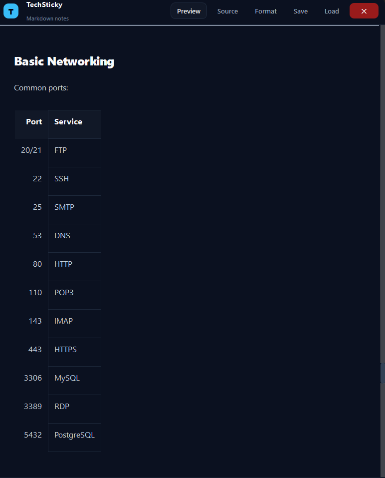
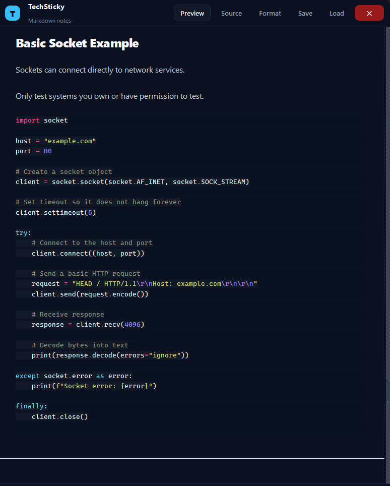
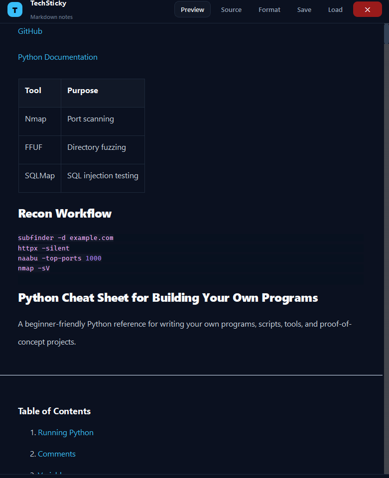

# TechSticky

TechSticky is a modern Markdown sticky notes application built with Python and PySide6.

Designed for developers, pentesters, students, and technical note taking, TechSticky combines a clean always-on-top interface with live Markdown rendering and syntax highlighted code blocks.

---

# Features

## Live Markdown Preview
Write Markdown and instantly preview formatted output in real time.

Supports:
- Headers
- Lists
- Tables
- Blockquotes
- Fenced code blocks
- Inline code
- Links

---

## Automatic Command Detection

TechSticky automatically detects terminal commands and wraps them inside formatted Markdown code blocks.

Example:

```bash
nmap -sV 10.10.10.10
ffuf -u https://target/FUZZ
subfinder -d example.com
```

Perfect for:
- Pentesting notes
- Recon workflows
- Bug bounty writeups
- Linux commands
- DevOps snippets

---

## Syntax Highlighting

Powered by:
- Markdown
- Pygments
- Custom Qt syntax highlighting

Supports highlighted:
- Bash
- Python
- JSON
- Configs
- General code blocks

---

## Always-On-Top Sticky Window

TechSticky stays above other windows so your notes remain visible while working.

Useful for:
- Cheat sheets
- Commands
- TODOs
- Study notes
- Active engagements

---

## Frameless Modern UI

Custom dark-mode interface featuring:
- Rounded corners
- Custom title bar
- Resize grip
- Smooth styling
- Minimalist layout

---

## Persistent Notes

Your notes automatically save locally.

TechSticky restores:
- Window position
- Window size
- Editor content
- Current mode

Storage location:

```text
~/.techsticky/
```

---

# Built With

- Python
- PySide6
- Markdown
- Pygments

---

# Installation

## Clone Repository

```bash
git clone https://github.com/Shawn2208/TechSticky.git
cd TechSticky
```

---

## Install Requirements

```bash
pip install -r requirements.txt
```

---

## Run Application

```bash
python app.py
```

---

# Requirements

```txt
markdown
Pygments
PySide6
```

---

# Build EXE (Windows)

Using PyInstaller:

```bash
pyinstaller --onefile --windowed --icon=icon_Png.ico app.py
```

Built executable will appear inside:

```text
dist/
```

---

# Screenshots

_Add screenshots here later_

Example:

```md

```

---

# Planned Features

- Multiple sticky notes
- Tabs/workspaces
- Theme support
- Note search
- Export to HTML/PDF
- Auto sync
- Plugin support

---

# Use Cases

TechSticky is ideal for:

- Cybersecurity notes
- Pentesting commands
- Programming snippets
- Study notes
- Markdown editing
- Quick documentation
- Persistent desktop reminders

---

# Screenshots




---




---




---

# License

MIT License

---

# Author

Built by Shawn C
